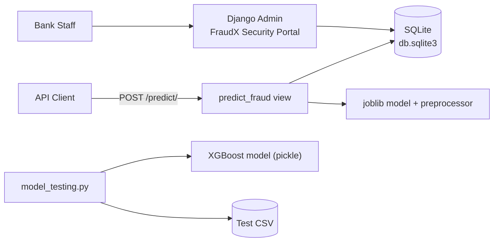
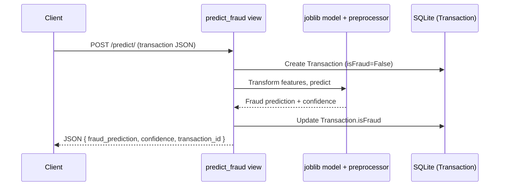

# FraudX: AI-Powered Fraud Detection System

A Django backend combining role-based bank staff management with a machine learning classifier that flags fraudulent transactions in real time.


## Table of Contents

- [Overview](#overview)
- [Problem Statement](#problem-statement)
- [Solution](#solution)
- [Features](#features)
- [Architecture](#architecture)
- [Tech Stack](#tech-stack)
- [Project Structure](#project-structure)
- [System Workflow](#system-workflow)
- [Installation](#installation)
- [Configuration](#configuration)
- [Running Locally](#running-locally)
- [API Documentation](#api-documentation)
- [Machine Learning Pipeline](#machine-learning-pipeline)
- [Author](#author)

## Overview

FraudX (branded in its Django admin as the "FraudX Security Portal") is a banking backend built for the Breach 2025 FinTech Hackathon at PDEU, where it won 1st place. It models bank staff with distinct roles and permissions, records financial transactions, and integrates a pre-trained classifier to flag transactions as fraudulent through a prediction endpoint.

## Problem Statement

Banks need to restrict who can view and manage sensitive transaction data based on an employee's role, while also flagging suspicious transactions automatically instead of relying purely on manual review.

## Solution

FraudX extends Django's built-in auth system with a custom `BankUser` model carrying banking-specific roles (System Administrator, Fraud Manager, Customer Support, Auditor), each auto-assigned to a matching permission group. A `Transaction` model mirrors common transaction fields (type, amount, origin/destination balances, fraud flags). A `/predict/` endpoint accepts a transaction payload, stores it, runs it through a pre-trained model, and updates the record with the prediction.

## Features

| Feature | Description |
|---|---|
| Role-based bank users | Custom `BankUser` model with four roles (Admin, Fraud Manager, Customer Support, Auditor), each auto-assigned to a matching Django permission group on save |
| Branded admin portal | Django admin customized as the "FraudX Security Portal," with transaction visibility filtered by role (non-admins only see non-fraud transactions) |
| Transaction tracking | `Transaction` model storing type, amount, origin/destination accounts and balances, fraud flags, and prediction timestamp |
| Fraud prediction endpoint | `POST /predict/` stores an incoming transaction and returns a model-generated fraud prediction with a confidence score |
| Database seeding | `populate_db` management command and `generate_test_data.py` script for generating sample transactions |
| Permission setup | `setup_perms` management command to create the banking permission groups (Administrators, Fraud Team, Customer Support) |
| Standalone model scoring | `model_testing.py` batch-scores a CSV of transactions with a separately trained XGBoost classifier |
| Onboarding frontend | A bundled frontend onboarding landing page (`fraud-x-onboarding-landingpage.zip`) |

## Architecture



## Tech Stack

| Layer | Technology |
|---|---|
| Backend framework | Django 5.1 |
| Database | SQLite |
| ML inference (API) | joblib-loaded classifier and preprocessor |
| ML inference (offline scoring) | XGBoost, pickle (`model_testing.py`) |
| Data handling | pandas, numpy |
| Frontend | Static onboarding landing page (bundled separately as a zip archive) |

## Project Structure

```
AI-Powered-Fraud-Detection-System/
├── antifraud/                  # Django project: settings, root URLconf
│   ├── settings.py
│   ├── urls.py
│   └── tests/test_requests.py  # Manual API smoke-test script
├── main/                        # Core app
│   ├── models.py                # BankUser and Transaction models
│   ├── views.py                 # predict_fraud view
│   ├── urls.py                  # predict/ route
│   ├── admin.py                 # FraudX Security Portal admin config
│   └── management/commands/     # populate_db, setup_perms, create_users
├── model_testing.py             # Standalone XGBoost batch scoring script
├── generate_test_data.py        # Random transaction generator
├── fraud_detection_model_real.pkl
├── fraud-x-onboarding-landingpage.zip
├── requirements.txt
└── manage.py
```

## System Workflow



## Installation

**Prerequisites:** Python 3.10+, pip

```bash
git clone https://github.com/KAVYAJOSHI1/AI-Powered-Fraud-Detection-System.git
cd AI-Powered-Fraud-Detection-System
python -m venv venv
source venv/bin/activate  # On Windows: venv\Scripts\activate
pip install -r requirements.txt
```

## Configuration

`antifraud/settings.py` currently ships with Django's default development settings: a hardcoded `SECRET_KEY`, `DEBUG = True`, and `ALLOWED_HOSTS = ['*']`. These are fine for local development but should be replaced with environment-variable-based configuration before any real deployment.

The `/predict/` view expects `fraud_model.joblib` and `preprocessor.joblib` in the project root; the repository currently includes a differently named model file (`fraud_detection_model_real.pkl`), so the prediction endpoint will need matching model artifacts in place to run end-to-end. Similarly, `main/urls.py` defines the `predict/` route, but it is not yet included in `antifraud/urls.py`'s root URLconf.

## Running Locally

```bash
python manage.py migrate
python manage.py createsuperuser
python manage.py setup_perms      # create banking permission groups
python manage.py populate_db      # optional: seed sample transactions
python manage.py runserver
```

The application runs at `http://127.0.0.1:8000/`, with the admin portal at `/admin/`.

## API Documentation

### `POST /predict/`

Accepts a transaction and returns a fraud prediction.

**Request body:**
```json
{
  "step": 45,
  "type": "TRANSFER",
  "amount": 1500000.00,
  "nameOrig": "C123456789",
  "oldbalanceOrg": 1500000.00,
  "newbalanceOrig": 0.00,
  "nameDest": "M987654321",
  "oldbalanceDest": 0.00,
  "newbalanceDest": 1500000.00
}
```

**Response:**
```json
{
  "fraud_prediction": false,
  "confidence": 0.03,
  "transaction_id": 42
}
```

## Machine Learning Pipeline

1. **Transaction intake:** the `/predict/` view receives a transaction payload and immediately stores it with `isFraud=False`.
2. **Feature preparation:** the numeric and categorical transaction fields (`step`, `type`, `amount`, and origin/destination balances) are assembled into a single-row DataFrame and passed through a saved preprocessor.
3. **Prediction:** the preprocessed features are scored by a pre-trained classifier, producing a fraud label and a confidence score.
4. **Record update:** the stored transaction is updated with the prediction result.
5. **Offline batch scoring:** separately, `model_testing.py` loads a pickled XGBoost classifier and scores a CSV of transactions, printing the count and indices of predicted-fraudulent rows.

## Author

**Kavya Joshi**
[Portfolio](https://kavyajoshi1.github.io/) · [LinkedIn](https://linkedin.com/in/kavya-joshi-3765742b0) · [GitHub](https://github.com/KAVYAJOSHI1)
